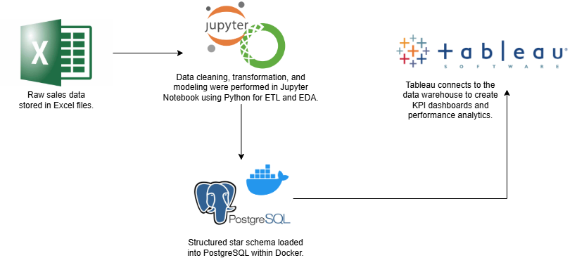
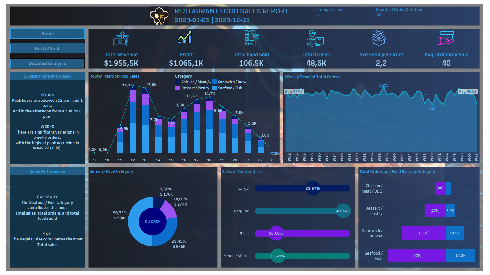
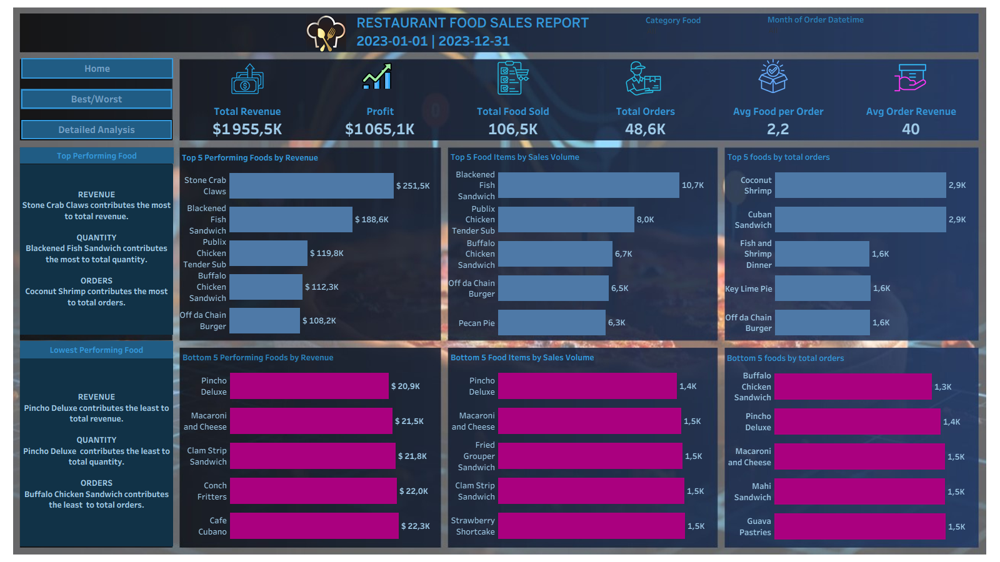

# 🍽 Restaurant Food Sales – End-to-End Data Engineering Pipeline

## 1️⃣ Problem Statement

Restaurant Food generates a high volume of daily transactional data across multiple locations.  
The raw Excel files contain inconsistent formats, missing values, and unstructured records, making it difficult to extract reliable insights regarding revenue, orders, promotions, and customer behavior without structured processing.

This project builds a complete **data engineering pipeline** to transform raw sales data into a structured data warehouse and interactive BI dashboards.

## 📅 Data Coverage

**Period:** January 1, 2023 – December 31, 2023  

## 📂 Data Source

- Raw data comes from restaurant Excel files ([here](restaurant_sales_2.xlsx)).
- Each file includes order-level transactional details such as:
  - Menu items
  - Quantities
  - Prices and food costs
  - Promotions and discounts
  - Payment methods
  - Restaurant metadata
- Data is processed in Python and loaded into **PostgreSQL (Docker)** for structured storage.


## 2️⃣ Business Questions

1. Which menu items generate the highest revenue?  
2. What are the peak hours and days for orders?  
3. How do promotional campaigns influence sales performance?  
4. Which restaurants contribute the most to total revenue?  
5. How do payment methods impact order volume?  
6. How do order size and item category affect profitability?  

## 3️⃣ Project Objectives

- Extract raw Excel data into Python.
- Clean, transform, and validate data using ETL processes.
- Design a **star-schema data warehouse** (fact & dimension tables).
- Load structured data into PostgreSQL running in Docker.
- Perform SQL-based analytical queries.
- Build Tableau dashboards to visualize KPIs and performance insights.
- Support operational and strategic decision-making.

## 4️⃣ 🛠 Technology Stack

1. **Python / Pandas** – ETL, cleaning, transformation, EDA  
2. **Jupyter Notebook** – Interactive data processing  
3. **PostgreSQL (Docker)** – Data warehouse storage  
4. **SQLAlchemy** – Database connection and loading  
5. **Tableau** – Business Intelligence visualization layer  
6. **Docker** – Reproducible database environment  
7. **WSL Ubuntu + VS Code** – Development environment  

## 5️⃣ High-Level Architecture



**Pipeline Flow:**

Excel (Source System)  
→ Python ETL (Cleaning & Transformation)  
→ PostgreSQL Data Warehouse (Docker)  
→ SQL Analysis  
→ Tableau Dashboards  

## 6️⃣ Project Structure

```
restaurant-sales-data-engineering/
├── ETL Process to Build a Data Pipeline.ipynb
├── Exploratory Data Analysis (EDA).ipynb
├── Restaurant.twb
├── E-R.drawio
├── enterprise-ready-architecture-diagram.drawio
├── images
├── restaurant_sales_2.xlsx
├── SQL_Exercises.md
├── README.md
├── Dockerfile
├── ingest_data.py
├── SetupProject.md
├── requirements.txt
├── restaurant_postgres_data/
└── Restaurant.twb
````


## 7️⃣ 📊 Data Visualizations

The dashboards are organized into **three primary sections**, each designed to answer specific business questions and highlight performance insights.

### 1️⃣ Home
Provides a high-level overview of key performance indicators such as total revenue, total orders, and overall sales trends.



### 2️⃣ Best / Worst
Focuses on performance comparison:


### 3️⃣ Detailed Analysis
Offers deeper insights into operational and financial performance:


## 8. 🔄 How to Run the Project

To explore and validate this project independently, follow these steps:

1. **Install Dependencies**  
   Ensure Python and the required libraries are installed in your environment.

2. **Execute ETL & EDA Notebooks**  
   Open the Jupyter notebooks and run the ETL process first, followed by the EDA analysis.

3. **Initialize PostgreSQL (Docker)**  
   Launch the PostgreSQL container and load the transformed fact and dimension tables.

4. **Connect Tableau**  
   Connect Tableau to the PostgreSQL database to refresh and interact with the dashboards.

> For a complete setup and execution walkthrough, refer to the `[here](SetupProject.md)` file included in the repository.


