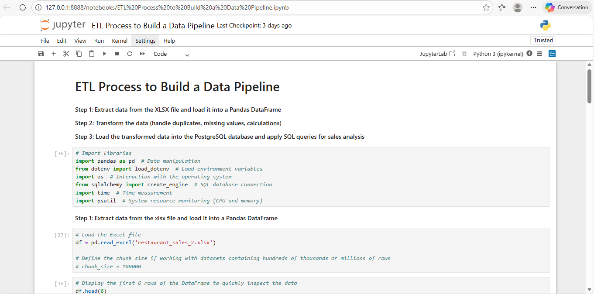
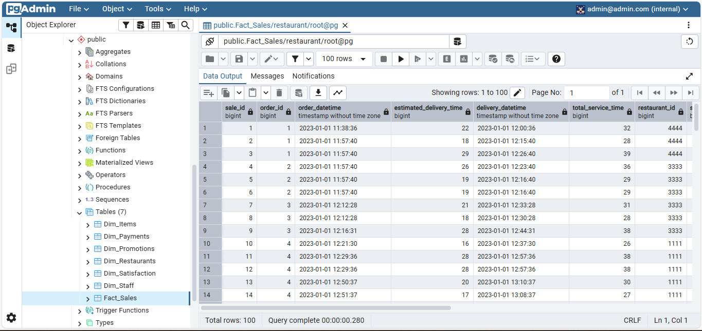
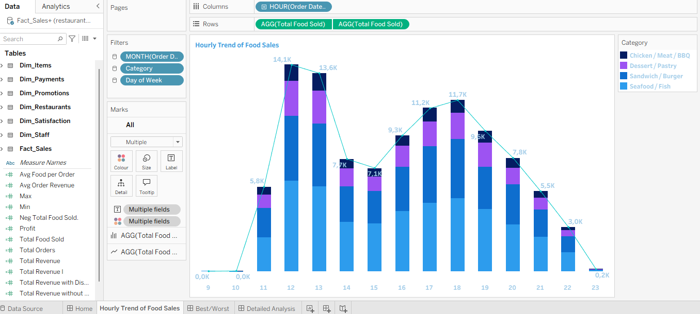
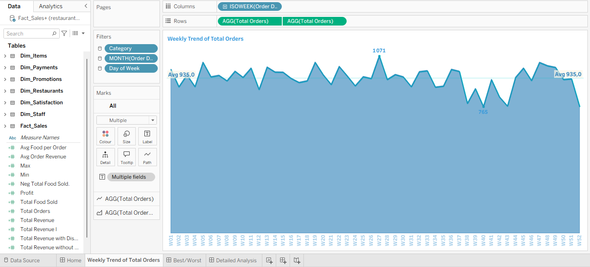
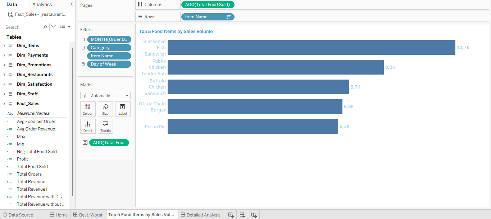
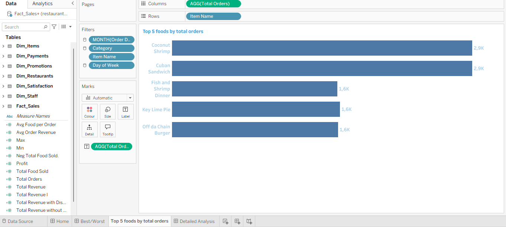
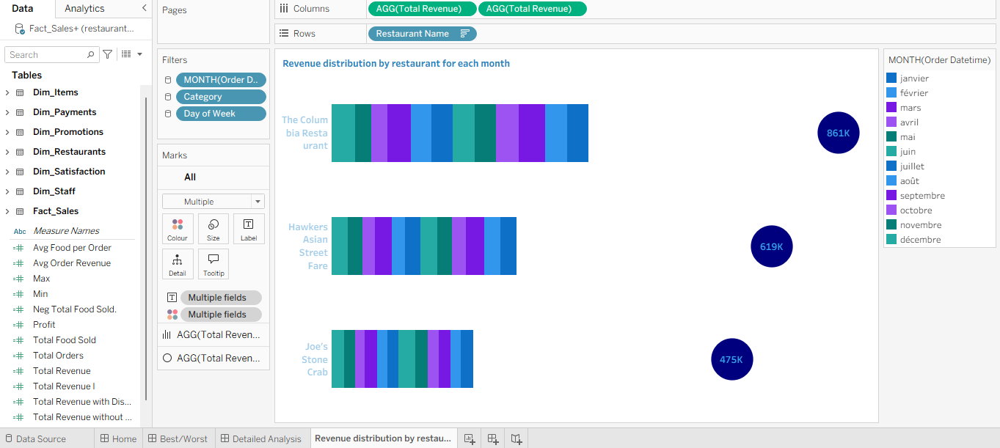
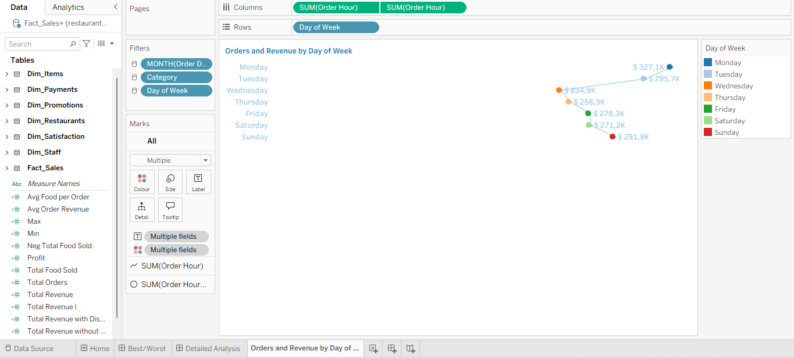
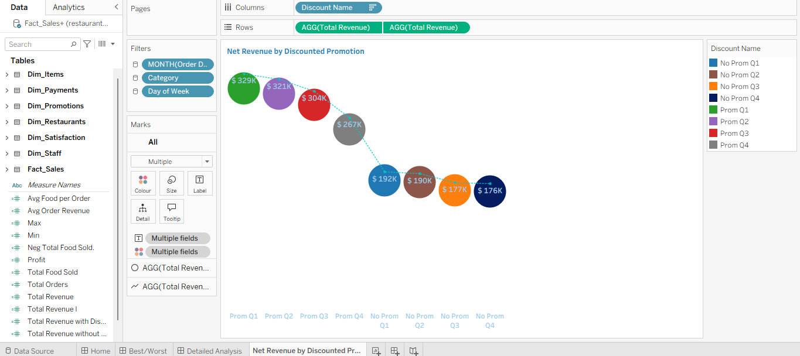

# 🛠️ Project Setup Guide

## 1️⃣ Clone the Repository

```bash
git clone https://github.com/whenslynady/restaurant-sales-data-engineering.git
cd restaurant-sales-data-engineering
````

> Recommended: Use **Ubuntu (WSL)** and open the project with `code .` for better Docker and Python integration.

---

## 2️⃣ Environment Preparation

* Open the project root in **VS Code**
* Install Python and Jupyter extensions when prompted
* Create a `.env` file in the project root:

```
PG_USER=root
PG_PASSWORD=root
PG_HOST=localhost
PG_PORT=5432
PG_DATABASE=restaurant
```
> **Note:** Change `PG_HOST` to `localhost` when running scripts locally without Docker.  
> Keep `pgdatabase` when running from a container connected to the Docker network.


## 3️⃣ Start Docker Containers

Create volume (one-time):

```bash
docker volume create restaurant_postgres_data
docker network create pg-network
```

Run PostgreSQL:

```bash
docker run -it \
  -e POSTGRES_USER="root" \
  -e POSTGRES_PASSWORD="root" \
  -e POSTGRES_DB="restaurant" \
  -v restaurant_postgres_data:/var/lib/postgresql/data \
  -p 5432:5432 \
  --network=pg-network \
  --name pgdatabase \
  postgres:18
```

Run pgAdmin (new terminal):

```bash
docker run -it \
  -e PGADMIN_DEFAULT_EMAIL="admin@admin.com" \
  -e PGADMIN_DEFAULT_PASSWORD="root" \
  -v pgadmin_data:/var/lib/pgadmin \
  -p 8080:80 \
  --network=pg-network \
  --name pgadmin \
  dpage/pgadmin4
```

Access pgAdmin:
`http://localhost:8080`


# 🔄 Execution Workflow

### Step 1 – Run ETL

* Open **ETL notebook**
* Clean and transform raw data
* Create fact and dimension tables
* Load data into PostgreSQL



🐘 Data Successfully Loaded into PostgreSQL

After validating the transformations, the processed data was loaded into PostgreSQL.
The image below shows the structured tables with successfully ingested records, confirming that the ETL pipeline executed correctly.



> ⚠️ **Optional:** You can also use a Python ingestion script instead of the Jupyter Notebook if you prefer automated execution.  
> ❗ Take note of the `.env` settings depending on your environment.

## 🐍 Option 1: Execute Python Script to Ingest Data Locally

```bash
python ingest_data.py --excel_path restaurant_sales_2.xlsx
````

> ⚠️ **Note:**
>
> * When running locally without Docker, make sure your `.env` has `PG_HOST=localhost`.
> * Keep `PG_HOST=pgdatabase` when running from a container connected to the Docker network.

## 🐳 Option 2: Python Script to Ingest Data into Docker Container

> ⚠️ **Note:** In a real environment, you would not use `--network=pg-network` as a parameter for the container; instead, provide the actual URL or IP of your database host.

```bash
# 1️⃣ Build the ingestion image
docker build --no-cache -t restaurant-ingestion .

# 2️⃣ Run the ingestion container
docker run --rm \
  --network=pg-network \
  -v "$(pwd)":/app \
  restaurant-ingestion:latest \
  --excel_path /app/restaurant_sales_2.xlsx \
  --user root \
  --password root \
  --host pgdatabase \
  --port 5432 \
  --db restaurant
```

> ✅ **Tip:** Use Option 1 for quick local testing and Option 2 when integrating with your Dockerized PostgreSQL environment.


### Step 2 – Perform EDA

* Open **EDA notebook**
* Analyze trends, categories, revenue drivers, and performance metrics  


> **Note:**  
> - For simple insights, you can use the Jupyter Notebook directly.  
> - For deeper analysis, you can choose to run queries either in the EDA notebook using SQL capabilities or directly inside PostgreSQL.  
> - Jupyter Notebook gives you access to run SQL queries if you prefer, or you can perform analysis inside PostgreSQL itself.  
> - If you want to verify SQL queries directly in PostgreSQL, you can access the SQL console with the following command:  

```bash
docker exec -it <container_name> psql -U root -d restaurant
````

> Example for this project:

```bash
docker exec -it 880d2683d07a psql -U root -d restaurant
```

Once inside the SQL console, here are a few example commands to explore your tables:

```sql
-- List all tables
\dt

-- See the first 5 rows of a table
SELECT * FROM "Fact_Sales" LIMIT 5;

-- Check table structure
\d "Fact_Sales";

-- Count total rows in a table
SELECT COUNT(*) FROM "Fact_Sales";

```

> **Tip:** You can find the SQL exercises and examples in the [SQL_Exercises.md](SQL_Exercises.md) file in the project repository.


### Step 3 – Connect Tableau

* Connect Tableau to PostgreSQL
* Build dashboards
* Refresh and validate KPIs


# 📊 Analytical Dashboards

## 🏷 KPI Executive Banner

The top section of the dashboard displays:


## 📈 Trend Analysis

### Hourly Sales Trend



### Weekly Order Trend



### Revenue by Category


### Revenue by Size


### Total Orders, Food Sales by Category


## 🏆 Top & Bottom Performance

### Top 5 by Revenue


### Bottom 5 by Revenue


### Top 5 by Quantity



### Bottom 5 by Quantity


### Top 5 by Orders



### Bottom 5 by Orders


## 🏢 Restaurant Performance

### Quarterly Revenue


### Monthly Distribution



### Orders & Revenue by Day




## 🎯 Promotions & Payment Insights

### Discounted vs Non-Discounted Revenue


### Net Revenue by Promotion



### Revenue & Orders by Payment Method


## ✅ Final Outcome

This project demonstrates a complete **Data Engineering pipeline**:

Raw Excel Data
→ ETL/EDA Processing
→ PostgreSQL Data Warehouse
→ SQL Analytics
→ Tableau Business Intelligence

The result is a structured, scalable, and reproducible system that transforms raw sales data into actionable business insights.